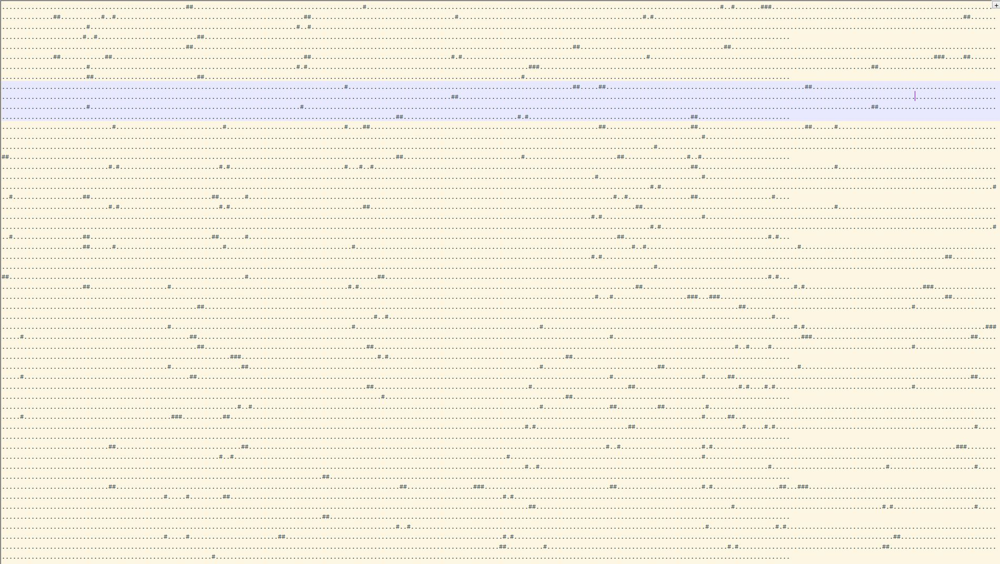
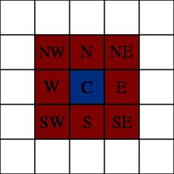
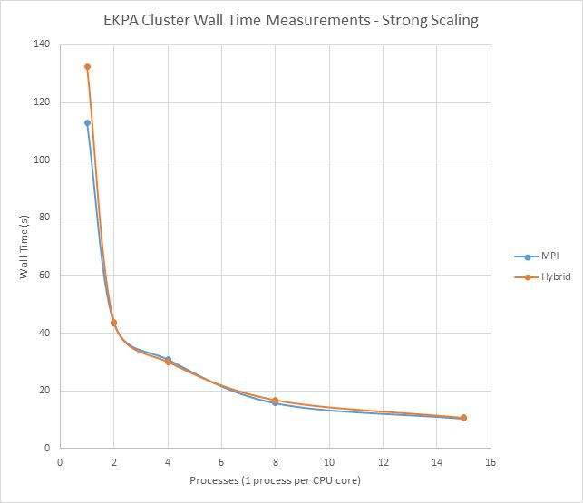

<h1 align="center">
	<a href="https://github.com/KeyC0de/GameOfLife_Serial_OpenMp_Cuda">The Game of Life</a>
</h1>

### Description

Here we've designed and implemented Conway's Game of Life, game algorithm; invented by John Conway in 1970.
The rules of this 0-player game (a video game playing without user input) are:

1. Any live cell with fewer than two live neighbors dies, as if by under-population.
2. Any live cell with two or three live neighbors lives on to the next generation.
3. Any live cell with more than three live neighbors dies, as if by overpopulation.
4. Any dead cell with exactly three live neighbors becomes a live cell, as if by reproduction.

The motivation for this project was to become familiar with parallel computing on the CPU, as well as with the GPU on the stream processing model.

### Usage

There are 6 different implementations:

1. Serial
2. Serial with OpenMP
3. MPI
4. MPI with OpenMP (aka Hybrid)
5. NVidia CUDA (using GPU's global memory)
6. NVidia CUDA using GPU's shared memory

C and C++ are the programming languages used throughout.
Out of those 6 only the last two are GPU accelerated. The first 4 are using the CPU in its entirety.

There lies complete documentation with esoteric programming details in Greek in Game\_ofLife\_M1485 pdf document. If there is a demand I will think about translating the project in English. However, I will mention enough key points in this document in my attempt to cover most, if not all, of the critical stuff. Furthermore, the code is thoroughly documented. Of course, if there's anything else you wish feel free to contact me.

I have first implemented the basic algorithm using the naive - serial CPU implementation. Then moved on to parallel CPU code. It was more intuitive this way and I was learning along the OpenMP, MPI and CUDA APIs as I was going. It was my first excursion into MPI and GPU CUDA territories.

Use the makefile either on *nix or Windows to build whichever version you want.

* make all : builds everything
* make serial : builds serial version
* make serial\_display : builds serial version with displaying
* make serial\_openmp : builds openmp version
* make serial\_openmp\_display
* make mpi : builds mpi
* make mpi\_openmp : builds mpi with openmp
* make mpi\_openmp\_display
* make cuda : builds CUDA
* make cuda_shared : builds CUDA shaded
* make clean : clean built files

The *_display variants show the results during game play, i.e. display the evolution of the grid every generation, while the game is running.

Example screenshot:

	

For reference we use the ASCII . (dot) to indicate a dead cell and the # (hash) to indicate a live cell.

Each line is a line of the grid and each column is the column of the 2x2 grid. Ghost rows and columns are not shown of course, they are taken in consideration when evaluating a cell (i.e. a grid or array element) on the boundaries of the grid. In those ghost cells the respective elements from the opposite side of the array are copied to evaluate the status of the current cell.
It works intuitively - exactly as you think it does:

	

Mathematically this is the Moore neighborhood of a point (@ C) and its 8 neighbors.
For example when we're considering C to be grid[2][1023] and the grid has 1024 columns then NE, E and SE will be ghost cells formed by a copy of the contents of grid[1][0], grid[2][0] and grid[3][0] respectively.

### Platform

Bear note that the platform I used was my computer running Windows 8.1 x86_64 Dual Booted with Linux 16.04.

For the MPI specification I used MPICH 3 which is *nix only. The serial and CUDA versions work on either platform, provided you've set up the environment. For windows there is a Visual Studio 2017 solution provided in the /cuda folder.

The computer used a single Intel Core i7 3770 CPU and the NVidia GeForce GTX 660 GPU (Cuda Compute Capability 3.0).
I have included datasheets with analytical details of the hardware, which you can find on the respective files.

Later I used the same programs to test against the clustered Parallel Computer provided by the University (ΕΚΠΑ).

### Measurements

You can find detailed analysis and instrumentation results on the file "Game\_of\_Life\_M1485\_metrics.xlsx".

I compare and contrast the results between my own computer and the University's computer. Measurements are taken regarding parallel speedup and efficiency (%) given number of assigned CPU cores - computer resources, number of elements (rows & columns) - problem size. We have used 10,000 generations. A generation is an instance of the grid as it develops given an input randomly populated grid (for all intents and purposes it is the field of the game at a certain point in time).

We perform these measurements twice, each time from the perspective of a different law. 
Firstly using Amdahl's law and secondly using Gustafson's law.
 
1. **Amdahl's Law** aka Strong scaling maintains the size of the input steady, while increasing the amount of computing units. Thus we compare performance while increasing the CPUs (or Cores) assigned to process the problem 
2. **Gustafson's Law** aka Weak scaling "spreads" an N-times larger problem using N computing units.

Strong Scaling performance on the University's computer:

	

# Contribute

Please submit any bugs you find through GitHub repository 'Issues' page with details describing how to replicate the problem. If you liked it or you learned something new give it a star, clone it, contribute to it whatever. Enjoy.

### License

Distributed under the GNU GPL V3 License. 
See "GNU GPL license.txt" for more information.

### Contact

email: *nik.lazkey@gmail.com*  
website: *www.keyc0de.net*

### Acknowledgments

University of Athens, Greece 
Department of Informatics and Telecommunications 
Parallel Computing Systems Class of 2017
